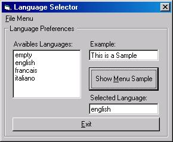



## App w/ Multiple Languages

### Description

UPGRADED: NOW MENU & TOOLTIPTEXT ENTRIES

This code permit to have a multiple language application. The LoadResString provided

with VB doesn't permit to end user to make a new language file.
 
### More Info
 
must have at least 1 language file (ex: english.lan) in the same directory of the app

             |
---                |---
**Submitted On**   |2000-03-23 15:22:40
**By**             |[Sergio P\.](https://github.com/Planet-Source-Code/PSCIndex/blob/master/ByAuthor/sergio-p.md)
**Level**          |Beginner
**User Rating**    |4.8 (19 globes from 4 users)
**Compatibility**  |VB 5\.0, VB 6\.0
**Category**       |[Miscellaneous](https://github.com/Planet-Source-Code/PSCIndex/blob/master/ByCategory/miscellaneous__1-1.md)
**World**          |[Visual Basic](https://github.com/Planet-Source-Code/PSCIndex/blob/master/ByWorld/visual-basic.md)
**Archive File**   |[CODE\_UPLOAD41553232000\.zip](https://github.com/Planet-Source-Code/sergio-p-app-w-multiple-languages__1-5443/archive/master.zip)

